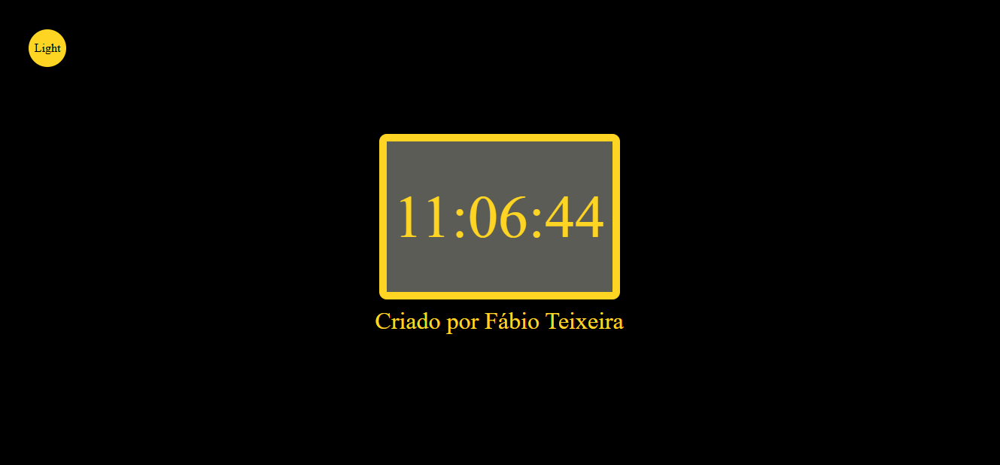

# ONLINE DIGITAL CLOCK

> Um site simples com a funcionalidade de exibir o horário do seu dispositivo, incluindo a função de modo escuro e modo claro.

### Ajustes e melhorias

O projeto ainda está em desenvolvimento e as próximas atualizações serão voltadas para as seguintes tarefas:

- [x] Tarefa 1 - Estrutura HTML e estilização do site com CSS
- [x] Tarefa 2 - Desenvolver lógica do relógio utilizando JavaScript 
- [x] Tarefa 3 - Adição da opção de Dark/Light Mode 
- [ ] Tarefa 4 - Adição de FrameWorks para melhorar responsividade
- [ ] Tarefa 5 - JavaScript vai evoluir para TypeScript, trazendo mais qualidade e organização ao código

## 💻 Pré-requisitos

Antes de começar, verifique se você atendeu aos seguintes requisitos:

- Um navegador moderno com JavaScript habilitado.
- Recomendado abrir no computador para melhor visualização e interação com o site.

## 🤝 Colaboradores

Projeto independente criado por mim: 

https://www.linkedin.com/in/f%C3%A1bio-teixeira-479919238/

